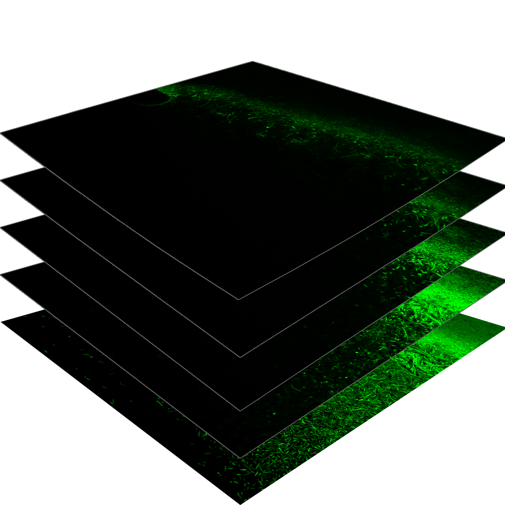

# exma
## extracellular matrix analyzer

**exma** is a command line program for analysis of biofilm thickness in both static and dynamic experiments. In addition to supplying the biofilm thickness of an experiment, exma can also stratify thickness of the biofilm by concentration of top stream vs. bottom stream in microfluidics mixing eperiments.

A biofilm, as interpreted by exma, can be represented with a series of images. The example set of images below is included in this repo.

These images all represent a vertical layer of a 3D snapshot for an experiment. Whether measuring the extracellular matrix or the individual cells, exma is able to stack these images, fill in gaps, and provide a customizable estimate of the biofilm thickness.



For microfluidics mixing experiments, exma can also calculate the concentration gradient of two fluids based on some constant data, then supply a thickness vs. concentration table for further analysis. This gradient can be combined with the thickness data to produce an image like the one shown below.


The following was printed from the help file of exma:

```
Usage:
  exma [OPTION...]

  -h, --help     Print help
  -v, --verbose  Verbose mode

 Biofilm options:
  -m, --minimum_threshold arg  Minimum intensity threshold for detection
                               (default: 50)
      --layer_blur arg         2D image blur radius (default: 0)
      --max_space arg          Largest allowable vertical gap (default: 100)

 Concentration options:
  -c, --concentration      Concentration gradient
      --conc_step arg      Step size for concentration lines around 50%
                           (default: 20)
      --conc_offset arg    Offset in pixels for start of concentration
                           analysis from mixing point (default: 200)
      --conc_fidelity arg  Number of iterations to calculate concentration
                           gradient (default: 10)

 Input/Output options:
  -f, --folder arg        Folder name containing image data
  -s, --save              Save all outputs as images
  -t, --table             Save thickness vs concentration as table
      --table_bins arg    Number of bins for output table (default: 500)
  -o, --overlay           Overlay descriptive information on outputs
  -d, --display           Display all outputs to screen
      --disp_percent arg  % scale of original image size (default: 30)
```

## Command line options

Note that all options with **arg** must be followed by a space, then the argument, then another space.

ex: **-m 51** sets the minimum threshold to 51

**--minimum_threshold 51** does the same

### Biofilm Options
*-m arg or --minimum_threshold arg* : Sets arg to be the minimum threshold for detecting whether a pixel "counts", and should therefore be included in the thickness. This is set to 50 unless changed.

*--layer_blur arg* : For each horizontal layer (each image) set the pixel blur radius. This is set to 0 unless changed (no blur), and should only be changed if image data has 'dead pixels' that can be smoothed out.

*--max_space arg* : Sets the maximum amount of 'empty vertical space' that will be counted between two detected pixels

  ex: for **--max_space 5**, and we have 10 layers as below ( | represents a detected pixel, . is undetected)
  
  |........| = ||........ <- Thickness  = 2
  
  |....|.... = ||||||.... <- Thickness  = 6
  
### Concentration Options
  *-c or --concentration* : Include this option to also calculate the concentration gradient for mixing between two streams in a microfluidics experiment. An image prompt with the bottom image will be provided so you can select the 'mixing point'
  
  *--conc_step arg* : Sets the step size for concentration lines in output image. The step size represents 
